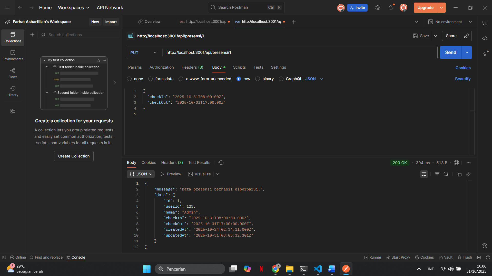
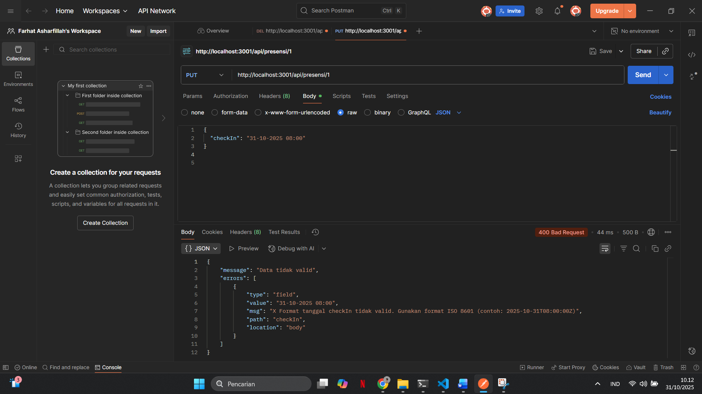
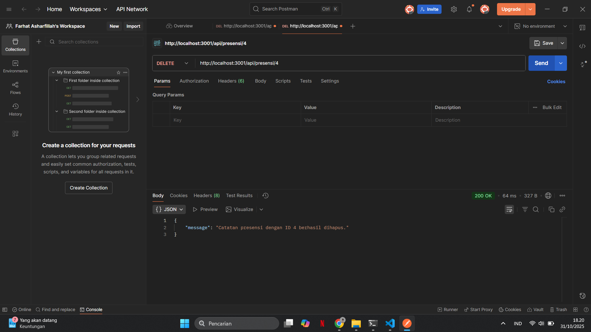
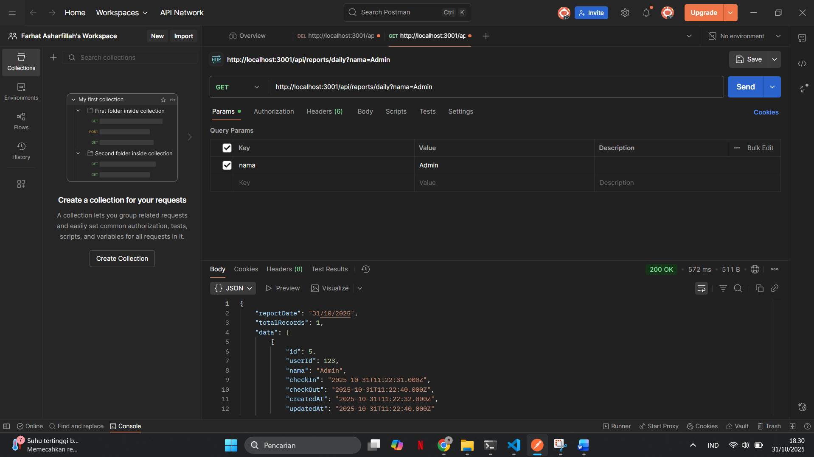
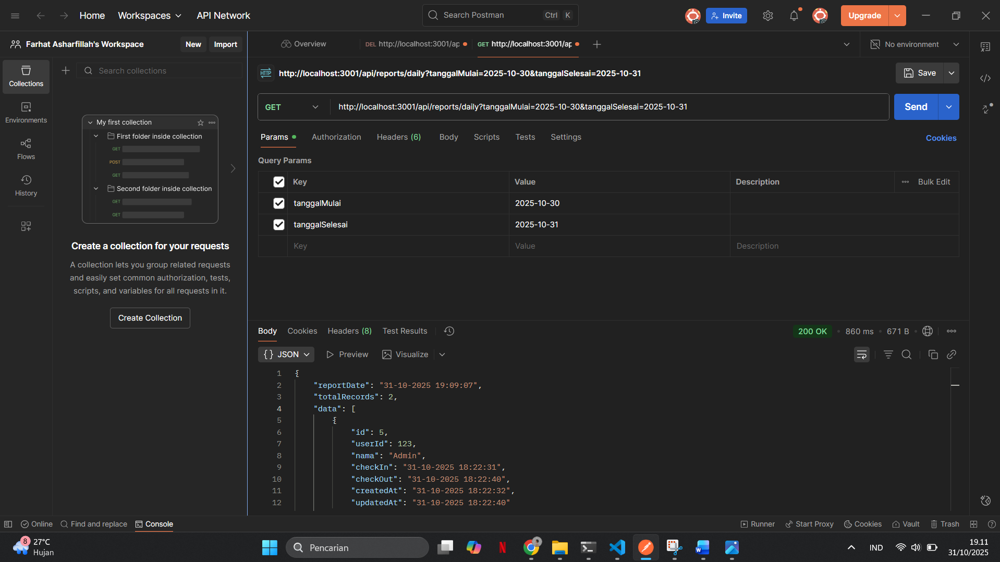

1.Tampilan Endpoint update data presensi:
   

2.Tampilan Endpoint update data presensi:
   

3.Tampilan Endpoint delete data:
   

4.Tampilan Enpoint search berdasarkan nama:
   

5.Tampilan Endpoint search berdasarkan tanggal:
   