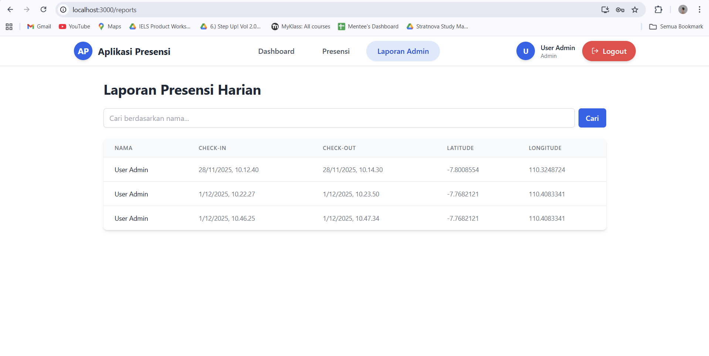
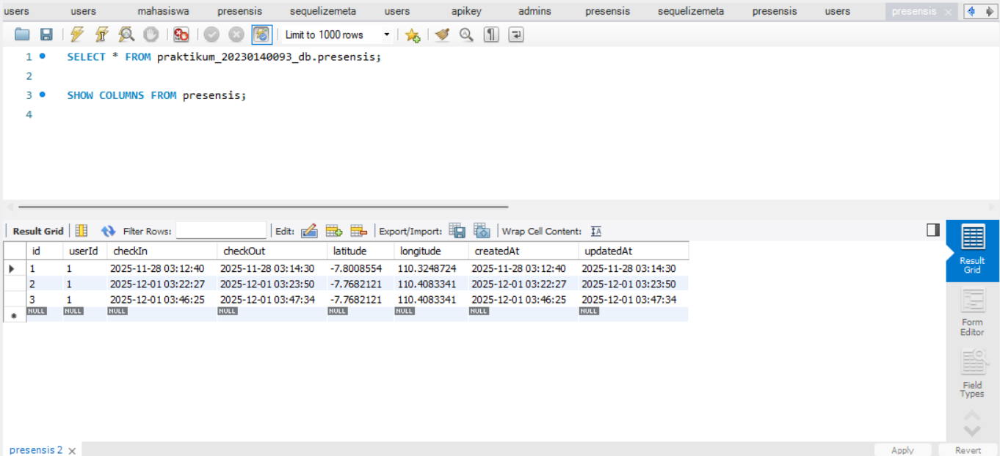

1.Tampilan Check-In:
   

2.Tampilan Check-Out:
   

3. Endpoint Check-In dengan Latitude dan Longtitude:
   

4. Tampilan Halaman Report yg Berisi Data Users:
   

5. Tabel Presensi Di Database:
   